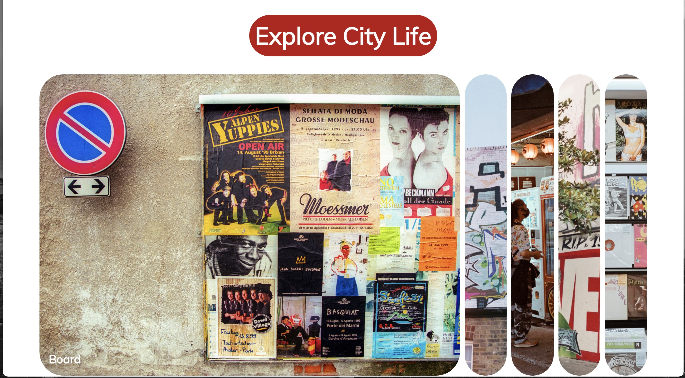

# Expanding Cards

For this project I built expanding cards. The cards are simple pictures with a description. Click on the cards to watch them expand and shrink as you click through them. This project can be used for many different things like a travel page showing different locations to explore and reviews for a page for customers to click through. 

[View deployed page here](https://caitlinswickard.github.io/expanding_cards/)
- [Installation](#install)
- [Usage](#usage)

## Install

Clone project:
- https://docs.github.com/en/repositories/creating-and-managing-repositories/cloning-a-repository

## Usage
Open page in live web browser and click on cards to see them expand. 

## Built With

- HTML
- CSS
- JavaScript

## View

### Credits
50 projects in 50 days HTML, CSS & JavaScript Udemy course
